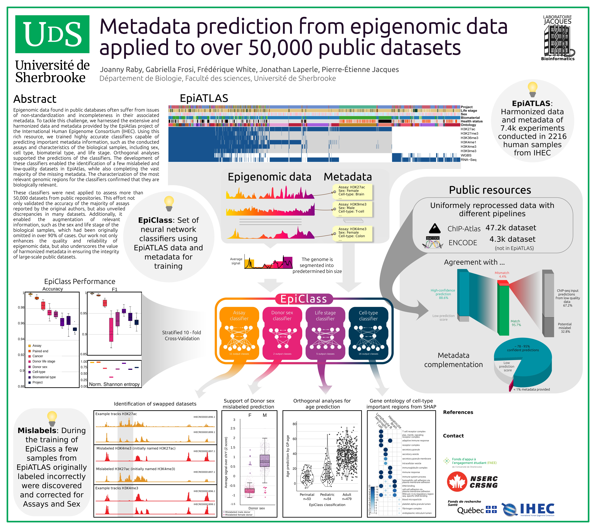
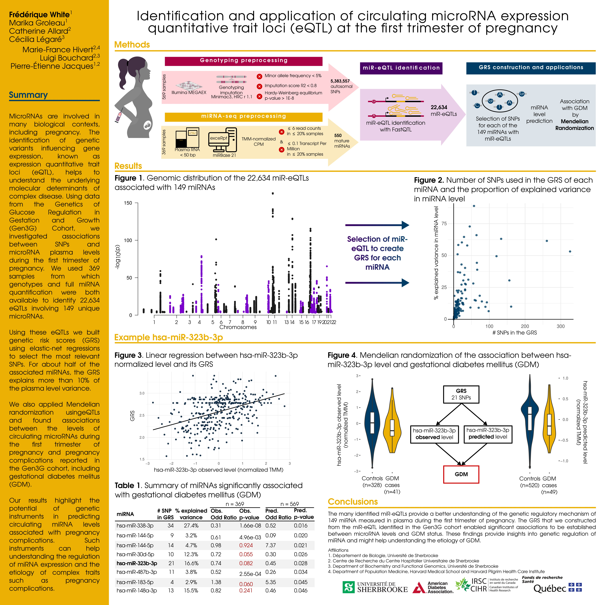

# Data Visualization Portfolio

Welcome to my portfolio. I am a Computational Biologist specializing in transforming complex datasets into clear, publication-ready visual insights. 

My goal is to ensuring every visualization serves as a powerful tool for both data interpretation and peer-reviewed publication.

---

## 📊 Featured Visualizations

### 1. Poster EpiClass
***Insight:** This visualization provides a clear and intuitive overview of the key workflow steps and core functionalities of the EpiClass tool.*

---

### 2. Poster plasma miR-QTL in pregnancy
***Insight:** This visualization summarizes the findings of a miR-QTL analysis using maternal plasma miRNAs during pregnancy.*

---
